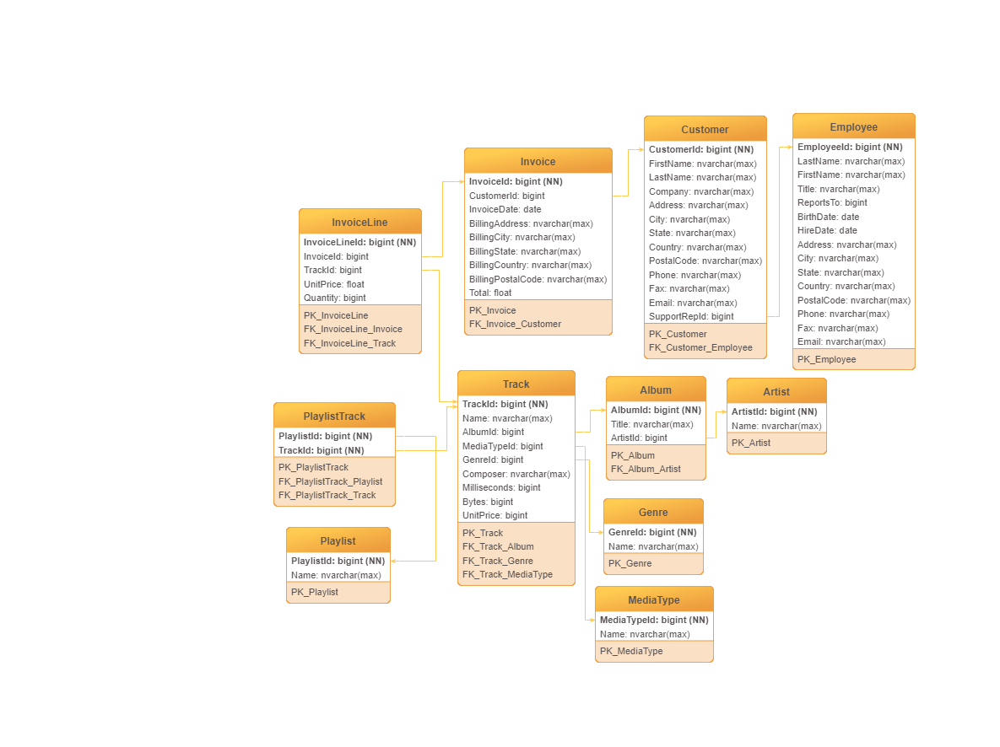
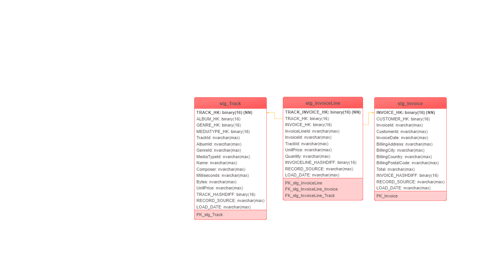
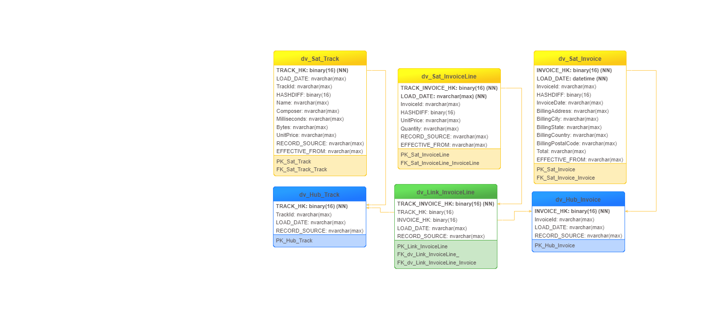
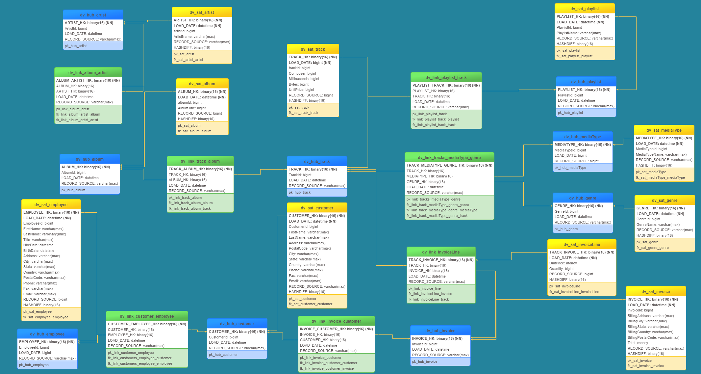
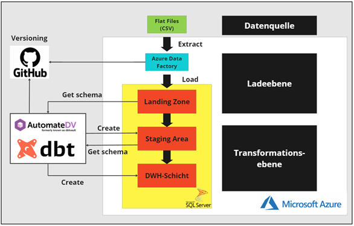

# Bachelorarbeit - Entwicklung einer Fallstudie auf Basis einer State of the Art Data Warehouse Architektur zu Schulungszwecken - Ein gestaltungsorientierter Ansatz

## 1. Abstract
Die Motivation für die Erstellung dieser Arbeit basiert auf dem derzeitigen
Fachkräftemangel im IT Sektor in Deutschland, der damit einhergehenden hohen
Nachfrage nach Bildungsangeboten und der Wichtigkeit von Schulungen im Bereich
Data Warehousing. Aus dieser Problemstellung heraus wurde eine Fallstudie zu
Schulungszwecken entwickelt, die auf einer State of the Art Data Warehouse
Architektur basiert. Zur Umsetzung dieses Forschungsvorhabens wurde die Design
Science Forschungsmethode verwendet. Ergebnis dieser Arbeit sind fünf
Schulungsaufgaben in Form einer Fallstudie. Gegenstand der Fallstudie ist die
Implementierung einer cloudbasierten Data Warehouse Architektur, die auf dem
Data Vault 2.0 Ansatz basiert. Softwarewerkzeuge, die im Rahmen der
Schulungsaufgaben genutzt wurden, sind Python, Git, GitHub , dbt und Dienste der
Microsoft Azure Umgebung.

## 2. Hintergrund und Aufgabenbeschreibung 
Der in diesem Repository beschriebene Code ist ein Artefakt aus der oben genannten Bachelorarbeit. 
Kern der Aufgabenstellung ist die Entwicklung einer Fallstudie zu Schulungszwecken im dem Bereich Data Warehousing. 
Die Entwicklung des Data Warehouse sollte hierbei auf Basis von State of the Art Werkzeugen und Ansätzen erfolgen. 
Die Bachelorarbeit wurde mit Hilfe des Design Science Ansatzes von Alan Hevner entwickelt. 

## 3. Ausgewählte Software zur Umsetzung des Vorhabens
Zur Umsetzung des oben beschriebenen Vorhabens wurden verschiede Anwendungen verwendet. Hierbei handelt es sich um die folgenden:
1. Data Build Tool (dbt) 
2. AutomateDV (dbt Bibliothek)
3. Python (Programmiersprache)
4. Eine IDE, wie zum Beispiel PyCharm
5. Microsoft SQL Server (Cloud Datenbank)
6. Microsoft Azure Data Services

## 4. Kernkonzepte der Fallstudie
Kernkonzepte, die im Rahmen der Fallstudie durchlaufen werden sollen sind:
1. Die Einrichtung einer skalierbaren Data Warehouse Architektur mittels eines ELT (Extract, Load, Transform) - Prozesses
2. Bedeutung und Implementierung der Konzepte vollständiges- und inkrementelles Laden
3. Kennenlernen des Datenmodellierungsansatzes Data Vault 2.0 
4Das Testen des Gesamtergebnisses in einer automatisierten CI/CD-Pipeline in GitHub Action 

## 5. Finale Data Warehouse Architektur 
Die finale Data Warehouse Architektur besteht aus den folgenden vier Schichten: 
1. Landing Zone 
2. Staging Area Schicht 
3. Data Warehouse Schicht 

Die Landing Zone hat den Zweck die Daten für die nachgelagerten Schichten zu Verfügung zu stellen. An dieser Stelle finden keine 
Datentransformationen statt und die Daten werden unberührt aus der Quelle in diese Schicht geladen. Die Daten werden mit Hilfe 
von einer Microsoft Azure Pipeline in die Landing Zone geladen. Die nachgelagerte Staging Area Schicht hat den Zweck die Daten aus der Landing Zone so schnell wie möglich zu laden und für die Data Warehouse Schicht aufzubereiten. In diesem Fall werden sämtliche 
Hash-Keys, Business Keys etc. hier mittels AutomateDV generiert, um eine Grundlage für die Generieung des Data Vault 2.0 Modells zu schaffen. 
Die Data Warehouse Schicht hat den Zweck das Data Vault 2.0 Modell basierend auf der Staging Area Schicht zu erzeugen und die Daten integriert und nicht-volatil zu speichern. 
Dafür wird das Konzept der Historisierung genutzt. Für die Staging Area Schicht und die Data Warehouse Schicht wurde dbt und AutomateDv genutzt. 

Eine Übersicht über die Tabellenstruktur in den einzelnen Schichten kann unten entnommen werden: 

Landing Zone:


Staging Area Schicht: 


Data Warehouse Schicht: 


Data Warehouse Schicht bei der Nutzung von allen Tabellen: 


Eine Übersicht über die gesamte Data Warehouse Architektur kann unten entnommen werden:


## 6. Ordnerstruktur 
```
───src
    ├───.github
    │   └───workflows
    ├───Anleitungen
    │   ├───Mit Lösung
    │   └───Ohne Lösung
    ├───AzurePipeline
    │   ├───dataset
    │   ├───DWHXX
    │   │   ├───globalParameters
    │   │   └───linkedTemplates
    │   ├───factory
    │   ├───linkedService
    │   └───pipeline
    ├───ChinookDatabase
    ├───Diagramme
    │   ├───1_Architektur
    │   ├───2_Landing_Zone
    │   ├───3_Staging_Area_Schicht
    │   └───4_Data Warehouse Schicht
    ├───models
    │   ├───ChinookXX
    │   │   ├───1_StagingArea
    │   │   └───2_DataWarehouseSchicht
    │   │       ├───2.1_Hubs
    │   │       ├───2.2_Links
    │   │       └───2.3_Satellites
    │   └───example
    └───tests
        ├───1_Test_LandingZone
        ├───2_Test_StagingArea
        └───3_Test_DataWarehouseSchicht
```

### 6.1 Models und Tests
In diesen Ordnern befindet sich der SQL-Code zur Erzeugung der Staging Area- Data Warehouse Schicht. Zur Nutzung müssen die 
.yml Dateien zunächst konfigueriert werden. 

### 6.2 Chinook Database 
Hier befinden sich die einzelnen Tabellen der Chinook Datenbank im CSV-Format. 

### 6.3 AzurePipeline 
Hier befinden sich die Metadaten aus der erstellten Azure Pipeline zur Erzeugung der Landing Zone 

### 6.4 Anleitungen
Hier befinden sich die Anleitungen der Fallstudie mit- und ohne Lösung

### 6.5 Workflow 
Hier befindet sich die Workflow Datei zur Nutzung von GitHub Action

### 6.6 Diagramme
Hier befinden sich einige Diagramme zur Visualisierung der einzelnen Tabellen in den dazugehörigen Schichten

## 7. Voraussetzungen zur Nutzung
Zur Nutzung dieses Artefakts müssen die folgenden Voraussetzungen erfüllt sein:
1. Es muss eine Python Version auf dem Rechner installiert sein. In dieser Arbeit wurde Python 3.10 genutzt
2. Es muss eine funktionierende dbt Version mit dem Microsoft SQL-Server Adapter installiert sein
3. Es müssen alle benötigten Bibliotheken in der requirements.txt Datei installiert sein
4. Es muss ein Microsoft Azure Account vorliegen

Die in Schritt 2 und Schritt 3 erwähnten Abhängigkeiten, können mit dem folgenden Befehl installiert werden: 
```
pip install -r requirements.txt
```

## 8. Lets Get Started!
Das Projekt kann from Scratch gebaut werden, indem die Anweisungen in den Anleitungen Schritt für Schritt befolgt werden.

## 9. Anmerkungen 
Dieses Artefakt wurde seit August 2023 nicht mehr aktualisiert. Entsprechend kann es sein, dass einige Abhängigkeiten nicht mehr aktuell sind.
